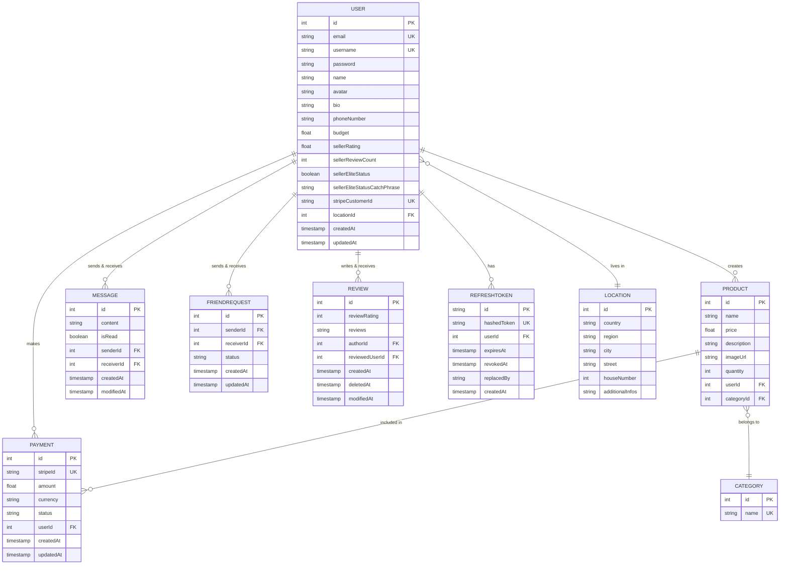

# *This project has been created as part of the 42 curriculum by mchanlia, tgomez-f, rchan-re and kkafmagh*

<!--  -->

# **Program Name** : ['TheGoodCorner']

### **Short Description** : 
> This project is a Web Application created in the context of 42 Curriculum's last project Ft_transcendence. It is a custom made e-commerce website that place users in relation in a market type environment where each can buy and sell markets goods to one another.

### **Table of Content**:

|  ---  |                Section                 |         ---         |
| :---: | :------------------------------------: | :-----------------: |
|  1.   |      [Description](#description)       | :large_blue_circle: |
|  2.   |     [Instructions](#instructions)      | :large_blue_circle: |
|  3.   |        [Resources](#resources)         | :large_blue_circle: |
|  4.   |   [Team Information](#team-information)| :large_blue_circle: |
|  5.   |   [Project Management](#project-management)| :large_blue_circle: |
|  6.   |   [Technical Stack](#technical-stack)| :large_blue_circle: |
|  7.   |   [Database Schema](#database-schema)| :large_blue_circle: |
|  8.   |   [Features List](#featured-list)| :large_blue_circle: |
|  9.   |   [Modules](#modules)| :large_blue_circle: |
|  10.  |   [Individual Contributions](#individual-contributions) |:large_blue_circle: |
  

# Description

## **Program Name**:
### TheGoodCorner

Introduction :

TheGoodCorner is a complete buy and sell website that tries to connect people by allowing them to see online products they posted and get in contact with the seller over a chat system.

The project ships a containerized application, that deals with real registered users over a database system and allows them to interact deeply with eachother.
It uses, a complete product management system allowing to upload image and a rich presentation of the product and a sorting and filtering system of the products. A complete profile management letting the user custom his own informations(username, email, avatar, phonenumber, etc...), with friends feature with online status, also you can post reviews on other users. A dedicated payment system over Stripe. A working user cart, and finally a notifications system.

- The aim of the project is to go over:

[How to setup a complete Web Architecture and a final polished product]  

- An HTTP Web-Server in the form of **NGINX** and associate .
- A basic Website in the form of **Wordpress**.
- A basic database implementation in the form of **MariaDB**.

This project emphasizes understanding of:
- Virtualization not of system as a whole but of application/services as processes using the Docker software technology
- The basics of system-architecture development (Dev-Ops).

### **Project Summary** :
The program instantiates Docker Images of subject-bound named services.  
It creates a network on the host machine(VM here), accessible via HTTPS protocol and allows the navigation on a NGINX hosted wordpress web-server.  
Everything is minimally configured but the point was to design the system-architecture not the website in itself.  
Wordpress is able to communicate with its own database and everything is stored in persistent volumes making it possible for data to stay persistent/present across multiple starts/restarts.

### **Project Description** :
[Virtual Machines vs Docker] :
> Virtual machines hosts themselves by using part of the physical hardware of the host machine an assigning it to themselves.  
>They also possess their own operating system and kernel (as a whole).  
> Whereas Docker only emulate the application layer of the kernel, it uses the hardware of the host (do not own its own virtual hardware).  
> Docker is faster, safer, more portable and easily configurable through DockerHub.  

[Secrets vs Environment Variables] :
> Secrets are specially identified Docker composed files that holds private API credentials. 
>This is meant to increase security as thoses passwords and sensitive data are not meant to be accessible through github (thanks to gitignore).  
> Environment variables are accessibles for all Dockers that are allowed to access them. They are used for configuration purposes (and infrastructure maintenance) and are critical to the user.  

[Docker Network vs Host Network] :
> By default Docker Containers can only see their own local network and they are isolated from the host unless they expose a port to it. Their default network configuration method between to container is bridged connection (isolated network connection segment).  
> It is possible to create local network for Dockers Containers to regroup them or isolate them from one another (like sub-netting) through the network command/attribute in the docker-compose file.  
> Docker Containers cannot access and cannot be accessed Host's network by any means other than ports.  
> Host network represent the host's actual network in the company's facilities or wherever he currently stays at.  
>It designate the interconnections between the different machines linked over the network .
  

Docker Volumes vs Bind Mounts:
> Docker Volumes and Bind Mounts are designed to deal with data persistency.  
> When shutting down the Dockers Containers, all of their writeable memory gets erased and the data is being lost. By creating Volumes or Binds Mounts we can solve this issue.  
> The main difference between volumes and bind mounts lies in how Docker Compose adjust itself to create this data persistency : Over volumes, it create a global virtual "Volume" that represent an external peripheral accessible for the Container.  
>In this regard, the Volume is named and known to both the host and the Container and is stored locally on the host machine under docker compose 's specified storage folder (the path you specify your volume to exist at). 
> Bind Mounts on the other hand is a hardcoded path in which a said service/container can store its data. The specified folder is mounted from the host to the docker container.  
> It is stored on the local host machine just like the volumes. It doesn't exist officially for the Docker-Compose (its not global). It is tied to a specific container and bypasses the logic of setting up global volumes environnment.  
  

### **Project Features** :

- Connection to NGINX Web-Server through port 443 only and using TLS encryption protocol.
- Navigation on Wordpress and communication to NGINX using FastCGI process manager technology (PHP-FPM).
- Database availability.
- Persistent data storage.
  

# Instructions

### **Installation** :
> ```  
> git clone <repo_url>  
> cd TheGoodCorner  
> make  
> ```

### **Usage** :
> ```  
> Access the website by typing https://mchanlia.42.fr or https://localhost on your local machine's web-browser.
>```
# Resources

#### Docs
[Documentation : Compose GettingStarted](https://docs.docker.com/compose/gettingstarted/)  
[Documentation : NGINX ConfigurationFile](https://nginx.org/en/docs/beginners_guide.html#conf_structure)  
[Documentation : NGINX Dockerization](https://medium.com/@srikanthjosyula/dockerizing-nginx-a-step-by-step-guide-for-beginners-a9bdc1944a44)  
[Documentation : NGINX HTTPS configuration](https://nginx.org/en/docs/http/configuring_https_servers.html)  
[Documentation : Debian](https://www.debian.org/releases/)  
[Documentation : NGINX ConfigurationFile](https://nginx.org/en/linux_packages.html#Debian)  
[Documentation : APT](https://manpages.debian.org/stretch/apt/apt.8.en.html)  
[Documentation : FASTCGI](https://fr.wikipedia.org/wiki/FastCGI)  
[Documentaiton : NGINX RequestProcess](https://nginx.org/en/docs/http/request_processing.html)  
[Documentation : FASTCGI Configuration](https://nginx.org/en/docs/http/ngx_http_fastcgi_module.html#fastcgi_param)  
[Documentation : Wordpress Installation](https://www.rosehosting.com/blog/how-to-install-wordpress-on-debian-12/)  
[Documentation : Wordpress Installation](https://make.wordpress.org/cli/handbook/guides/installing/)  
[Documentation : Wordpress InstallationVerification](https://make.wordpress.org/cli/handbook/guides/verifying-downloads/)  
[Documentation : SED](https://www.ionos.fr/digitalguide/serveur/configuration/commande-sed-de-linux/)  
[Documentation : MariaDB Installation](https://mariadb.com/docs/server/clients-and-utilities/deployment-tools/mariadb-install-db)  
[Documentation : Docker/Networkng](https://docs.docker.com/engine/network/)  
[Documentation : Docker/Storage](https://docs.docker.com/engine/storage/)  
[Documentation : Docker/Volume](https://docs.docker.com/engine/volumes/)  
[Documentation : Compose Environment](https://docs.docker.com/compose/how-tos/environment-variables/set-environment-variables/)  
[Documentation : Docker/Volume](https://docs.docker.com/reference/compose-file/volumes/)  
[Documentation : Test Command](https://www.it-connect.fr/verifier-la-presence-dun-repertoire-ou-dun-fichier/)  
[Documentation : Network Bridge](https://en.wikipedia.org/wiki/Network_bridge)  
[Documentation : Mysql Socket](https://www.digitalocean.com/community/tutorials/how-to-troubleshoot-socket-errors-in-mysql)  
[Documentation : Curl Command](https://www.geeksforgeeks.org/linux-unix/curl-command-in-linux-with-examples/)  
[Documentation : Shell Basics](https://pressbooks.senecapolytechnic.ca/uli101/chapter/shell-scripting-basics/)  
[Documentation : Set Command](https://www.geeksforgeeks.org/linux-unix/shell-scripting-set-command/)

#### Videos
[Video : Docker Essentials](https://www.youtube.com/watch?v=pg19Z8LL06w)  
[Video : NGINX linuxServer](https://www.youtube.com/watch?v=MP3Wm9dtHSQ)  
[Video : NGINX linuxServer](https://www.youtube.com/watch?v=n7vKxkMIBM0)  
[Video : PHP-FPM Wordpress](https://www.youtube.com/watch?v=TswVrfNQZHc)  

#### Others
[linode](https://en.wikipedia.org/wiki/Linode)


# Team Information

# Project Management

# Technical Stack
### Frontend

| Technology | Purpose | Justification |
|-----------|---------|---------------|
| **React.js** | UI framework for building component-based interfaces | Excellent ecosystem, reusability, and performance optimization tools |
| **Tailwind CSS** | Utility-first CSS framework for styling | Rapid development, consistent design system, smaller bundle size than alternatives |
| **Lucide React** | Icon library with React components | Lightweight, customizable, and tree-shakeable icons |
| **Axios** | HTTP client for API requests | Promise-based, interceptor support for authentication and error handling |
| **React Router** | Client-side routing and navigation | Standard routing solution for React SPAs with nested routes and lazy loading |
| **Zustand** | State management | Minimal boilerplate, easier to learn and maintain than Redux |
| **Motion (Framer Motion)** | Animation and motion library | Smooth animations, gesture support, and great performance |

**Frontend Justification:** This stack prioritizes developer experience and performance. Tailwind CSS eliminates CSS maintenance, Lucide provides consistent icons, and Axios with React Router creates a solid foundation for API communication and navigation. Zustand and Motion complete the UX with state management and smooth interactions.

---

### Backend

| Technology | Purpose | Justification |
|-----------|---------|---------------|
| **Node.js** | JavaScript runtime | Enables full-stack JavaScript development, non-blocking I/O for scalability |
| **TypeScript** | Static typing for JavaScript | Prevents runtime errors, improves code maintainability and IDE support |
| **Express.js** | Web framework for REST APIs | Lightweight, flexible, middleware-based architecture for modular code |
| **Socket.io** | Real-time bidirectional communication | WebSocket support with fallbacks, automatic reconnection, and room-based messaging for live features |

**Backend Justification:** Node.js with TypeScript provides type safety and a unified JavaScript ecosystem. Express is minimal yet powerful enough for complex API requirements without unnecessary overhead. Socket.io enables real-time features (messaging, notifications, live updates) with built-in reliability and fallback mechanisms for browsers that don't support WebSockets.

---

### Database & ORM

| Technology | Purpose | Justification |
|-----------|---------|---------------|
| **PostgreSQL** | Relational database | ACID compliance, advanced features, excellent scalability for complex queries |
| **Prisma ORM** | Type-safe database toolkit | Auto-generated queries, type inference from schema, eliminates SQL bugs or SQL injections|

**Database Justification:** PostgreSQL ensures data integrity and supports complex relationships. Prisma keeps types synchronized across backend and database, reducing errors and improving developer productivity.

---

### Additional Technologies

| Technology | Purpose |
|-----------|---------|
| **Stripe** | Payment processing and secure transaction handling |

---

# Database Schema



# Features List

# Modules

# Individual Contributions