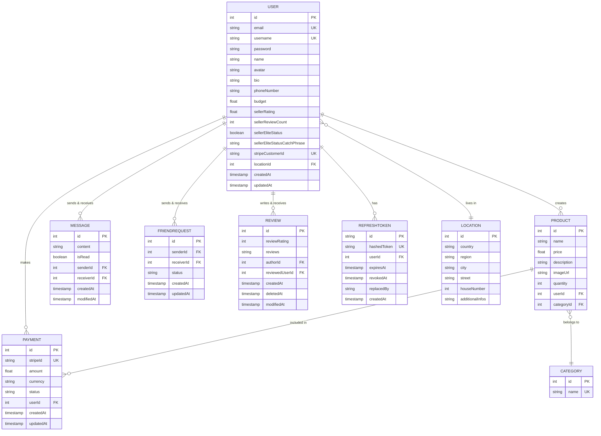

# *This project has been created as part of the 42 curriculum by mchanlia, tgomez-f, dpaiva, chdoe and chlimous*

<!--  -->

# **Program Name** : ['TheGoodCorner']

### **Short Description** : 
> This project is a Web Application created in the context of 42 Curriculum's last project Ft_transcendence.  
> It is a custom made e-commerce website that place users in relation in a market type environment where each can buy and sell markets goods to one another.  

### **Table of Content**:

|  ---  |                Section                 |         ---         |
| :---: | :------------------------------------: | :-----------------: |
|  1.   |      [Description](#description)       | :large_blue_circle: |
|  2.   |     [Instructions](#instructions)      | :large_blue_circle: |
|  3.   |        [Resources](#resources)         | :large_blue_circle: |
|  4.   |   [Team Information](#team-information)| :large_blue_circle: |
|  5.   |   [Project Management](#project-management)| :large_blue_circle: |
|  6.   |   [Technical Stack](#technical-stack)| :large_blue_circle: |
|  7.   |   [Database Schema](#database-schema)| :large_blue_circle: |
|  8.   |   [Features List](#featured-list)| :large_blue_circle: |
|  9.   |   [Modules](#modules)| :large_blue_circle: |
|  10.  |   [Individual Contributions](#individual-contributions) |:large_blue_circle: |
  

# Description

## **Program Name**:
### TheGoodCorner

Introduction :

TheGoodCorner is a complete buy and sell website that tries to connect people by allowing them to see online products they posted and get in contact with the seller over a chat system.  
It is meant as a P2P (peer to peer) solution to help people sell and buy more easily in a decentralized way.  
The website works from the get go without an account although several features are served only under the possession of a user account.

#### The aim of the project is to go over:

[How to setup a complete Web Architecture and a final polished product]  

- Desigining a fully fledged Front-End, expressing creativity.
- Desigining an optimised, reliable and predictable Back-End.
- Think about the whole picture: how to assembles an architecture that efficiently handle users requests.
- Users experience as a central part of the designing process.
- Handle traffic, network and request made over the site in a graceful way.
- Have basic knowledge of security principles, to protect the core infrastructure of the site.
- Use new programming languages to gain new perspectives on programming as a whole.

### **Project Summary** :

The project ships a containerized application, that deals with real registered users over a database system and allows them to interact deeply with eachother.  
It uses, a complete product management system allowing to upload image, a rich presentation of the product and a sorting and filtering system.  
There is also a  complete profile management that lets the user custom his own informations(username, email, avatar, phonenumber, etc...), a friends feature with online status.  
You can also post reviews on other sellers to give insights to buyers on a seller's reputation.  
Moreover the website ships with it's dedicated payment system over Stripe, A working user cart.  
Finally a notifications system that keeps tracks of important matters to the user.


# Instructions

### **Installation** :

First clone the repository to your machine :

> ```bash
> git clone <repo_url>  
> cd TheGoodCorner
> ```

Copy the the environment file into the back directory or manually fill and rename the env_example file :

```bash
cd TheGoodCorner/back
cp <path to your .env> .
or 
mv .env_example .env
```

Simply run `make` to build and start all containers:
>```bash
> make
>```

To target and start a specific container, use:
>```bash
> make <container_name>
>```


### **Usage** :
Access the website by typing:  
https://localhost:4443 for signed certificate access (secure encrypted website access)  
or  
http://localhost:8080 for non encrypted connection on your local machine's web-browser.

# Resources

#### Docs
[Documentation : Offline PWA](https://www.itnetwork.fr/blog/application-web-hors-ligne/)  
[Documentation : SEO Scoring - Lighthouse validation](https://nginx.org/en/docs/beginners_guide.html#conf_structure)  
[Documentation : SEO Scoring - Lighthouse validation](https://developer.chrome.com/docs/lighthouse/seo/meta-description?utm_source=lighthouse&utm_medium=devtools&hl=fr)  
[Documentation : SEO Scoring - Lighthouse validation](https://developer.chrome.com/docs/lighthouse/seo/invalid-robots-txt?utm_source=lighthouse&utm_medium=devtools&hl=fr)  
[Documentation : React pagination](https://www.contentful.com/blog/react-pagination/)  
[Documentation : NGINX HTTPS configuration](https://nginx.org/en/docs/http/configuring_https_servers.html)  
[Documentation : Stripe test payment](https://docs.stripe.com/testing)  
[Documentation : Stripe CLI](https://docs.stripe.com/cli)  
[Documentation : Stripe metadata](https://docs.stripe.com/api/metadata)  
[Documentation : Stripe payment methods](https://docs.stripe.com/api/payment_methods/object)  
[Documentation : Stripe payment integration](https://medium.com/@harshilsharmaa51/integrate-stripe-payment-with-nodejs-and-save-it-in-database-42a6b53c479b)  
[Documentation : NGINX ConfigurationFile](https://nginx.org/en/linux_packages.html#Debian)  
[Documentaiton : NGINX RequestProcess](https://nginx.org/en/docs/http/request_processing.html)  
[Documentation : API - LoadBalancer - ReverseProxy](https://www.reddit.com/r/devops/comments/py1q54/difference_between_reverse_proxy_load_balancer/)  
[Documentation : CORS principles](https://developer.mozilla.org/fr/docs/Web/HTTP/Guides/CORS)  
[Documentation : CORS principles](https://developer.mozilla.org/en-US/docs/Web/HTTP/Reference/Headers/Access-Control-Allow-Headers)  
[Documentation : CORS principles](https://portswigger.net/web-security/cors/access-control-allow-origin)  
[Documentation : Http headers](https://blog.postman.com/what-are-http-headers/)  
[Documentation : Http codes](https://fr.wikipedia.org/wiki/Liste_des_codes_HTTP)  
[Documentation : Multer API integration](https://medium.com/@julien.maffar/impl%C3%A9mentation-de-multer-dans-une-api-node-js-e358dd513e64)  
[Documentation : Multer middleware](https://expressjs.com/fr/resources/middleware/multer/)  
[Documentation : Multer](https://www.npmjs.com/package/multer)  
[Documentation : Prisma env variables](https://www.prisma.io/docs/orm/v7/more/dev-environment/environment-variables)  
[Documentation : Typescript tutorial](https://www.typescriptlang.org/fr/docs/handbook/2/modules.html)  
[Documentation : Typescript tutorial](https://www.typescriptlang.org/tsconfig/#noEmitOnError)  
[Documentation : Typescript tutorial](https://www.typescriptlang.org/docs/handbook/2/everyday-types.html#non-null-assertion-operator-postfix-)  
[Documentation : Docker/Networkng](https://docs.docker.com/engine/network/)  
[Documentation : Docker/Storage](https://docs.docker.com/engine/storage/)  
[Documentation : Docker/Volume](https://docs.docker.com/engine/volumes/)  
[Documentation : Compose Environment](https://docs.docker.com/compose/how-tos/environment-variables/set-environment-variables/)  
[Documentation : Docker/Volume](https://docs.docker.com/reference/compose-file/volumes/)  
[Documentation : Network Bridge](https://en.wikipedia.org/wiki/Network_bridge)  

#### Videos
[Video : Docker Essentials](https://www.youtube.com/watch?v=pg19Z8LL06w)  
[Video : NGINX linuxServer](https://www.youtube.com/watch?v=MP3Wm9dtHSQ)  
[Video : NGINX linuxServer](https://www.youtube.com/watch?v=n7vKxkMIBM0)  


# Team Information

# Project Management

# Technical Stack
### Frontend

| Technology | Purpose | Justification |
|-----------|---------|---------------|
| **React.js** | UI framework for building component-based interfaces | Excellent ecosystem, reusability, and performance optimization tools |
| **Tailwind CSS** | Utility-first CSS framework for styling | Rapid development, consistent design system, smaller bundle size than alternatives |
| **Lucide React** | Icon library with React components | Lightweight, customizable, and tree-shakeable icons |
| **Axios** | HTTP client for API requests | Promise-based, interceptor support for authentication and error handling |
| **React Router** | Client-side routing and navigation | Standard routing solution for React SPAs with nested routes and lazy loading |
| **Zustand** | State management | Minimal boilerplate, easier to learn and maintain than Redux |
| **Motion (Framer Motion)** | Animation and motion library | Smooth animations, gesture support, and great performance |

**Frontend Justification:** This stack prioritizes developer experience and performance. Tailwind CSS eliminates CSS maintenance, Lucide provides consistent icons, and Axios with React Router creates a solid foundation for API communication and navigation. Zustand and Motion complete the UX with state management and smooth interactions.

---

### Backend

| Technology | Purpose | Justification |
|-----------|---------|---------------|
| **Node.js** | JavaScript runtime | Enables full-stack JavaScript development, non-blocking I/O for scalability |
| **TypeScript** | Static typing for JavaScript | Prevents runtime errors, improves code maintainability and IDE support |
| **Express.js** | Web framework for REST APIs | Lightweight, flexible, middleware-based architecture for modular code |
| **Socket.io** | Real-time bidirectional communication | WebSocket support with fallbacks, automatic reconnection, and room-based messaging for live features |

**Backend Justification:** Node.js with TypeScript provides type safety and a unified JavaScript ecosystem. Express is minimal yet powerful enough for complex API requirements without unnecessary overhead. Socket.io enables real-time features (messaging, notifications, live updates) with built-in reliability and fallback mechanisms for browsers that don't support WebSockets.

---

### Database & ORM

| Technology | Purpose | Justification |
|-----------|---------|---------------|
| **PostgreSQL** | Relational database | ACID compliance, advanced features, excellent scalability for complex queries |
| **Prisma ORM** | Type-safe database toolkit | Auto-generated queries, type inference from schema, eliminates SQL bugs or SQL injections|

**Database Justification:** PostgreSQL ensures data integrity and supports complex relationships. Prisma keeps types synchronized across backend and database, reducing errors and improving developer productivity.

---

### Additional Technologies

| Technology | Purpose |
|-----------|---------|
| **Stripe** | Payment processing and secure transaction handling |

---

# Database Schema



# Features List

# Modules

# Individual Contributions
# Known limitations