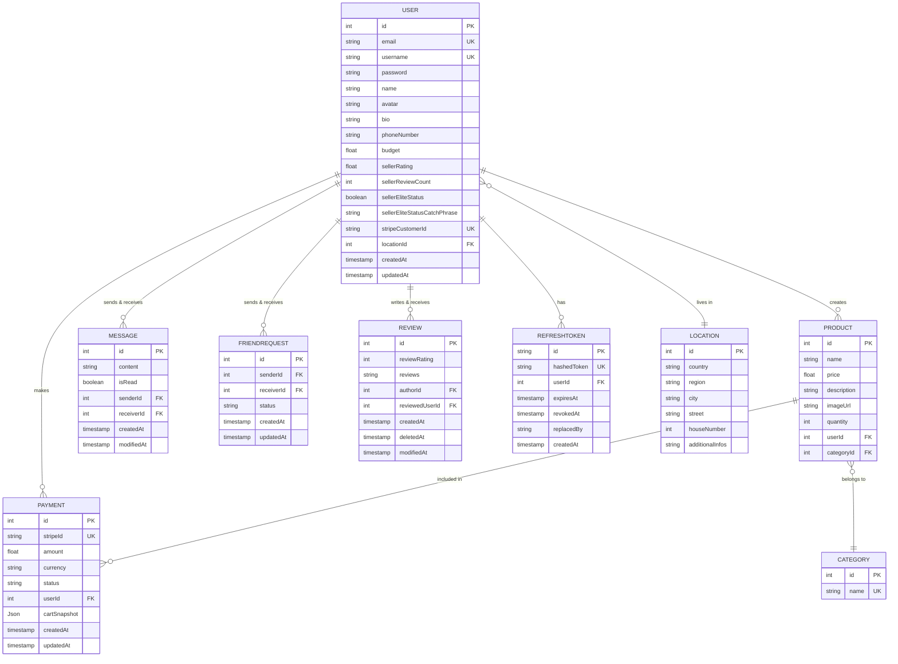

# *This project has been created as part of the 42 curriculum by mchanlia, tgomez-f, dpaiva, chdoe and chlimous*

<!--  -->

# **Program Name** : ['TheGoodCorner']

### **Short Description** : 
> This project is a Web Application created in the context of 42 Curriculum's last project Ft_transcendence.  
> It is a custom made e-commerce website that place users in relation in a market type environment where each can buy and sell markets goods to one another.  

### **Table of Content**:

|  ---  |                Section                 |         ---         |
| :---: | :------------------------------------: | :-----------------: |
|  1.   |      [Description](#description)       | :large_blue_circle: |
|  2.   |     [Instructions](#instructions)      | :large_blue_circle: |
|  3.   |        [Resources](#resources)         | :large_blue_circle: |
|  4.   |   [Team Information](#team-information)| :large_blue_circle: |
|  5.   |   [Project Management](#project-management)| :large_blue_circle: |
|  6.   |   [Technical Stack](#technical-stack)| :large_blue_circle: |
|  7.   |   [Database Schema](#database-schema)| :large_blue_circle: |
|  8.   |   [Features List](#featured-list)| :large_blue_circle: |
|  9.   |   [Modules](#modules)| :large_blue_circle: |
|  10.  |   [Individual Contributions](#individual-contributions) |:large_blue_circle: |
  

# Description

## **Program Name**:
### TheGoodCorner

Introduction :

TheGoodCorner is a complete buy and sell website that tries to connect people by allowing them to see online products they posted and get in contact with the seller over a chat system.  
It is meant as a P2P (peer to peer) solution to help people sell and buy more easily in a decentralized way.  
The website works from the get go without an account although several features are served only under the possession of a user account.

#### The aim of the project is to go over:

[How to setup a complete Web Architecture and a final polished product]  

- Desigining a fully fledged Front-End, expressing creativity.
- Desigining an optimised, reliable and predictable Back-End.
- Think about the whole picture: how to assembles an architecture that efficiently handle users requests.
- Users experience as a central part of the designing process.
- Handle traffic, network and request made over the site in a graceful way.
- Have basic knowledge of security principles, to protect the core infrastructure of the site.
- Use new programming languages to gain new perspectives on programming as a whole.

### **Project Summary** :

The project ships a containerized application, that deals with real registered users over a database system and allows them to interact deeply with eachother.  
It uses, a complete product management system allowing to upload image, a rich presentation of the product and a sorting and filtering system.  
There is also a  complete profile management that lets the user custom his own informations(username, email, avatar, phonenumber, etc...), a friends feature with online status.  
You can also post reviews on other sellers to give insights to buyers on a seller's reputation.  
Moreover the website ships with it's dedicated payment system over Stripe, A working user cart.  
Finally a notifications system that keeps tracks of important matters to the user.


# Instructions

### **Installation** :

First clone the repository to your machine :

> ```bash
> git clone <repo_url>  
> cd TheGoodCorner
> ```

Copy the the environment file into the back directory or manually fill and rename the env_example file :

```bash
cd TheGoodCorner/back
cp <path to your .env> .
or 
mv .env_example .env
```

Simply run `make` to build and start all containers:
>```bash
> make
>```

To target and start a specific container, use:
>```bash
> make <container_name>
>```


### **Usage** :
Access the website by typing:  
https://localhost:4443 for signed certificate access (secure encrypted website access)  
or  
http://localhost:8080 for non encrypted connection on your local machine's web-browser.

# Resources

---

<details>
  <summary>📚 Documentation</summary>

[Documentation : Offline PWA](https://www.itnetwork.fr/blog/application-web-hors-ligne/)  
[Documentation : SEO Scoring - Lighthouse validation](https://nginx.org/en/docs/beginners_guide.html#conf_structure)  
[Documentation : SEO Scoring - Lighthouse validation](https://developer.chrome.com/docs/lighthouse/seo/meta-description?utm_source=lighthouse&utm_medium=devtools&hl=fr)  
[Documentation : SEO Scoring - Lighthouse validation](https://developer.chrome.com/docs/lighthouse/seo/invalid-robots-txt?utm_source=lighthouse&utm_medium=devtools&hl=fr)  
[Documentation : React pagination](https://www.contentful.com/blog/react-pagination/)  
[Documentation : Stripe test payment](https://docs.stripe.com/testing)  
[Documentation : Stripe CLI](https://docs.stripe.com/cli)  
[Documentation : Stripe metadata](https://docs.stripe.com/taapi/medata)  
[Documentation : Stripe payment methods](https://docs.stripe.com/api/payment_methods/object)  
[Documentation : Stripe payment integration](https://medium.com/@harshilsharmaa51/integrate-stripe-payment-with-nodejs-and-save-it-in-database-42a6b53c479b)  
[Documentation : NGINX HTTPS configuration](https://nginx.org/en/docs/http/configuring_https_servers.html)  
[Documentation : NGINX ConfigurationFile](https://nginx.org/en/linux_packages.html#Debian)  
[Documentaiton : NGINX RequestProcess](https://nginx.org/en/docs/http/request_processing.html)  
[Documentation : NGINX limit req command](https://nginx.org/en/docs/http/ngx_http_limit_req_module.html)  
[Documentation : API - LoadBalancer - ReverseProxy](https://www.reddit.com/r/devops/comments/py1q54/difference_between_reverse_proxy_load_balancer/)  
[Documentation : CORS principles](https://developer.mozilla.org/fr/docs/Web/HTTP/Guides/CORS)  
[Documentation : CORS principles](https://developer.mozilla.org/en-US/docs/Web/HTTP/Reference/Headers/Access-Control-Allow-Headers)  
[Documentation : CORS principles](https://portswigger.net/web-security/cors/access-control-allow-origin)  
[Documentation : HTPP](https://blog.postman.com/what-are-http-headers/)  
[Documentation : HTPP](https://fr.wikipedia.org/wiki/Liste_des_codes_HTTP)  
[Documentation : Port](https://en.wikipedia.org/wiki/List_of_TCP_and_UDP_port_numbers)  
[Documentation : Multer](https://medium.com/@julien.maffar/impl%C3%A9mentation-de-multer-dans-une-api-node-js-e358dd513e64)  
[Documentation : Multer](https://expressjs.com/fr/resources/middleware/multer/)  
[Documentation : Multer](https://www.npmjs.com/package/multer)  
[Documentation : Typescript tutorial](https://www.typescriptlang.org/fr/docs/handbook/2/modules.html)  
[Documentation : Typescript tutorial](https://www.typescriptlang.org/tsconfig/#noEmitOnError)  
[Documentation : Typescript tutorial](https://www.typescriptlang.org/docs/handbook/2/everyday-types.html#non-null-assertion-operator-postfix-)  
[Documentation : Typescript tutorials](https://www.w3schools.com/typescript/typescript_arrays.php)  
[Documentation : Javascript tutorials](https://developer.mozilla.org/fr/docs/Web/JavaScript/Reference/Global_Objects/Date)  
[Documentation : Javascript tutorials](https://lecoints.fr/guide-es5-es6-es2016-es2024-esnext/)  
[Documentation : Javascript tutorials](https://www.w3schools.com/js/js_2022.asp)  
[Documentation : Javascript tutorials](https://developer.mozilla.org/fr/docs/Glossary/Asynchronous)  
[Documentation : Javascript tutorials](https://developer.mozilla.org/en-US/docs/Learn_web_development/Extensions/Async_JS/Introducing)  
[Documentation : Javascript tutorials ](https://grafikart.fr/tutoriels/fonctions-2059#autoplay)  
[Documentation : Javascript tutorials](https://grafikart.fr/tutoriels/javascript-promise-2067#autoplay)  
[Documentation : Javascript tutorials ](https://js.muthu.co/posts/implicit-explicit-nominal-structuring-and-duck-typing/)  
[Documentation : Javascript tutorials](https://www.geeksforgeeks.org/javascript/how-to-check-for-null-undefined-or-blank-variables-in-javascript/)  
[Documentation : Javascript tutorials](https://stackoverflow.com/questions/35706164/typescript-import-as-vs-import-require)  
[Documentation : Docker Compose](https://docs.docker.com/compose/how-tos/environment-variables/set-environment-variables/)  
[Documentation : Docker Compose](https://lours.me/posts/compose-tip-020-docker-compose-logs/)  
[Documentation : Docker](https://docs.docker.com/build/building/best-practices/#minimize-the-number-of-layers)  
[Documentation : Docker](https://docs.docker.com/reference/cli/docker/container/exec/)  
[Documentation : Docker](https://docs.docker.com/engine/network/)  
[Documentation : Docker](https://docs.docker.com/engine/storage/)  
[Documentation : Docker](https://docs.docker.com/engine/volumes/)  
[Documentation : Docker](https://docs.docker.com/reference/compose-file/volumes/)  
[Documentation : Network Bridge](https://en.wikipedia.org/wiki/Network_bridge)  
[Documentation : Create React App](https://create-react-app.dev/)  
[Documentation : React UI](https://fr.react.dev/learn/describing-the-ui)  
[Documentation : Introduction to React](https://legacy.reactjs.org/tutorial/tutorial.html)  
[Documentation : Motion Library](https://motion.dev/)  
[Documentation : HTML Balises](https://facemweb.com/blog/creation-site/liste-balises-html/)  
[Documentation : Zustand Library](https://zustand.docs.pmnd.rs/)
[Documentation : Lucid Icons Library](https://lucide.dev/guide/)  
[Documentation : Prisma](https://www.prisma.io/docs/orm/v7/more/dev-environment/environment-variables)  
[Documentation : Sockets](https://medium.com/@basukori8463/build-a-real-time-chat-app-from-scratch-with-node-js-and-socket-io-9714)  
[Documentation : Prisma](https://www.prisma.io/docs/orm/reference/error-reference)  
[Documentation : Prisma](https://www.prisma.io/docs/guides/deployment/docker)  
[Documentation : Prisma](https://www.prisma.io/docs/orm/v6/overview/prisma-in-your-stack/is-prisma-an-orm)  
[Documentation : Prisma](https://medium.com/@alpercitak/dockerize-next-js-with-prisma-19b7b9d82134)  
[Documentation : I18n](https://lingui.dev/introduction)  
[Documentation : I18n](https://fr.wikipedia.org/wiki/Internationalisation_(informatique))  
[Documentation : I18n](https://www.i18next.com/)  
[Documentation : Express Router](https://expressjs.com/en/5x/api/router/)  
[Documentation : Express Router](https://www.geeksforgeeks.org/web-tech/express-js-express-router-function/)  
[Documentation : NPM](https://blog.logrocket.com/npm-vs-npx/)  
[Documentation : NPM](https://docs.npmjs.com/uninstalling-packages-and-dependencies)  
[Documentation : NPM](https://stackoverflow.com/questions/43664200/what-is-the-difference-between-npm-install-and-npm-run-build)  
[Documentation : NPM](https://docs.npmjs.com/cli/v9/commands/npm-prune)  
[Documentation : Object to JSON conversion](https://www.geeksforgeeks.org/typescript/how-to-convert-an-object-to-a-json-string-in-typescript/)  
[Documentation : introduction to JSON Web Tokens](https://www.jwt.io/introduction#difference-decoding-encoding-jwt)  
[Documentation : NodeJs releases](https://nodejs.org/en/about/previous-releases)  
[Documentation : Tsconfig.json](https://www.typescriptlang.org/docs/handbook/tsconfig-json.html)  
[Documentation : Basic SQL syntaxe](https://www.w3schools.com/sql/sql_syntax.asp)  

</details>

---

<details>
  <summary>🎓 Tutoriels</summary>

[Video : Docker Essentials](https://www.youtube.com/watch?v=pg19Z8LL06w)  
[Video : NGINX linuxServer](https://www.youtube.com/watch?v=MP3Wm9dtHSQ)  
[Video : NGINX capabilities](https://www.youtube.com/watch?v=OEFZUj_RQKc)  
[Video : NGINX linuxServer](https://www.youtube.com/watch?v=n7vKxkMIBM0)
[Video : Best backend Framework in 2025](https://www.youtube.com/watch?v=qZ6w9_MhmJ0)  
[Video : React tuto](https://www.youtube.com/watch?v=h2a0cSC1Vz8&t=15s)  
[Video : Building Shopping Cart](https://www.youtube.com/watch?v=AdmB2CJ9I9E)  
[Video : Authentication in React with JWTs, Access & Refresh Tokens](https://www.youtube.com/watch?v=AcYF18oGn6Y)  
[Video : Complete tuto User managment](https://www.youtube.com/watch?v=VOmHs6-NNgc&list=PLSJnlFr3D-mHNQYzpfBCt9ezHxbgxaAZi)  
[Video : API Authentication](https://www.youtube.com/watch?v=bP1mo3UbhNg)  
[Video : Authentication Concepts](https://www.youtube.com/watch?v=iX8g4LqF8p8)  

</details>

---

# Team Information

| 42 login | Name | Role(s) | Responsibilities |
| --- | --- | --- | --- |
| `mchanlia` | Maxence Chanliat | PO/PM / Backend/Frontend Developer | Backend development, Backend API, DevOps, Debugging, Frontend support |
| `tgomez-f` | Thomas Gomez | PO/PM / Frontend/Backend Developer | Frontend development, Frontend API, Mocking, UI Integration, Backend support |
| `dpaiva` | Delphine Paiva | PM/Tech Lead / Frontend Developer / Frontend development, Notification service | Frontend architecture, UI integration|
| `chdoe` | Chloé Bond | PM/Tech Lead | Frontend Developer, Team Coordination, Frontend development, Debugging, Language support and architecture |
| `chlimous` | Charles Limousin | PM/Tech Lead | Backend development, Backend services, 2FA service |
# Project Management

# Technical Stack

### Frontend

| Technology | Purpose | Justification |
|-----------|---------|---------------|
| **React.js** | UI framework for building component-based interfaces | Excellent ecosystem, reusability, and performance optimization tools |
| **Tailwind CSS** | Utility-first CSS framework for styling | Rapid development, consistent design system, smaller bundle size than alternatives |
| **Lucide React** | Icon library with React components | Lightweight, customizable, and tree-shakeable icons |
| **Axios** | HTTP client for API requests | Promise-based, interceptor support for authentication and error handling |
| **React Router** | Client-side routing and navigation | Standard routing solution for React SPAs with nested routes and lazy loading |
| **Zustand** | State management | Minimal boilerplate, easier to learn and maintain than Redux |
| **Motion (Framer Motion)** | Animation and motion library | Smooth animations, gesture support, and great performance |

**Frontend Justification:** This stack prioritizes developer experience and performance. Tailwind CSS eliminates CSS maintenance, Lucide provides consistent icons, and Axios with React Router creates a solid foundation for API communication and navigation. Zustand and Motion complete the UX with state management and smooth interactions.

---

### Backend

| Technology | Purpose | Justification |
|-----------|---------|---------------|
| **Node.js** | JavaScript runtime | Enables full-stack JavaScript development, non-blocking I/O for scalability |
| **TypeScript** | Static typing for JavaScript | Prevents runtime errors, improves code maintainability and IDE support |
| **Express.js** | Web framework for REST APIs | Lightweight, flexible, middleware-based architecture for modular code |
| **Socket.io** | Real-time bidirectional communication | WebSocket support with fallbacks, automatic reconnection, and room-based messaging for live features |

**Backend Justification:** Node.js with TypeScript provides type safety and a unified JavaScript ecosystem. Express is minimal yet powerful enough for complex API requirements without unnecessary overhead. Socket.io enables real-time features (messaging, notifications, live updates) with built-in reliability and fallback mechanisms for browsers that don't support WebSockets.

---

### Database & ORM

| Technology | Purpose | Justification |
|-----------|---------|---------------|
| **PostgreSQL** | Relational database | ACID compliance, advanced features, excellent scalability for complex queries |
| **Prisma ORM** | Type-safe database toolkit | Auto-generated queries, type inference from schema, eliminates SQL bugs or SQL injections|

**Database Justification:** PostgreSQL ensures data integrity and supports complex relationships. Prisma keeps types synchronized across backend and database, reducing errors and improving developer productivity.

---

### Additional Technologies

| Technology | Purpose |
|-----------|---------|
| **Stripe** | Payment processing and secure transaction handling |
| **Lingui** | i18n service for easy regional translations handling |

---

# Database Schema



# Features List

| Feature | Description |
|---|---|
| 🔐 **Authentication & Session Management** | Registration and login via email/password, logout. Session maintained via in-memory access token and httpOnly cookie refresh token. Silent reconnection on page load with automatic token refresh on 401 response. |
| 🛍️ **Product Catalog (Marketplace)** | Paginated product list with filters by category (standard and custom) and price range. Detail page with image, description, quantity selector, seller information and similar product suggestions. |
| ➕ **Product Listing** | Announcement creation form (name, price, category, description, image) with client-side validation and multipart upload. |
| 🛒 **Shopping Cart** | Add, remove and modify item quantities. Stock availability verification and prevention of buying own products. Cart persisted in localStorage and accessible via navbar popover. |
| 💳 **Payment (Stripe) & Virtual Wallet** | Integrated payment flow via Stripe Elements (PaymentElement). Virtual wallet balance display before checkout and confirmation page after successful payment. |
| 📋 **Order History** | Page listing past transactions with status, date, amount and details of purchased items (image and quantity). |
| 👤 **User Profile** | View and edit personal profile (email, phone, bio, address, avatar) with validation. Public seller profile with listings, average rating and registration date. Account deletion. |
| ⭐ **Reviews & Seller Ratings** | Rating system (1-5 stars) with comments. One review per seller, editable and deletable. Automatic "Elite Seller" badge at 20+ reviews. |
| 💬 **Instant Messaging** | Real-time private messaging (Socket.IO). Conversations with search, message thread, send/edit/delete messages. Unread message badges and conversation hiding. |
| 👥 **Friends System** | Send, accept, decline and cancel friend requests. Friends list with real-time online/offline status indicator. |
| 🔔 **Notifications** | Notification center grouping unread messages, new reviews and friend requests, updated in real-time. Enable/disable from settings. |
| 🌓 **Light/Dark Theme** | Toggle between light and dark theme from Navbar or Settings. Preference persisted in localStorage and applied via CSS tokens. |
| ⚙️ **Account Settings** | Language selection, theme and notification toggle, developer mode (fictional credit for testing), permanent account deletion. |
| 📄 **Legal Pages & FAQ** | Static pages: Privacy Policy, Terms of Use and FAQ with anchored table of contents. |
| 📱 **PWA & Offline Resilience** | Production Service Worker for resource caching and offline browsing. Automatic version detection with reload prompt. |
| 🔗 **API Layer Robustness** | Centralized HTTP client (Axios) with automatic token attachment, queue during refresh and rate limiting handling on 429 error. |
| 🎨 **Design System / UI Kit** | Reusable component library (Button, Dropdown, Avatar, FormField, Popover, EmptyState, StarRating, etc.) driven by CSS tokens for visual consistency and light/dark compatibility. |
| 🌐 **Multi-language Support (EN/ES)** | Complete interface translation in English and Spanish. Language selector in Settings with persistent selection in localStorage. Dynamic language switching without page reload via i18n system (Lingui). All UI strings, error messages, notifications and help text localized. Support for RTL languages ready for future expansion. |

---

# Modules
- Module 1 | Major 2pts
- Module 2 | Minor 1pts
-

# Individual Contributions

Maxence:
Thomas:
Delphine:
Chloé:
Charles:

# Known limitations

- groupe split fin aout
- deadlines shorts
- blackhole ?